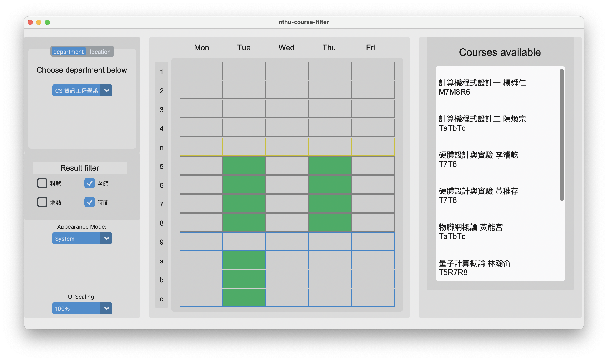
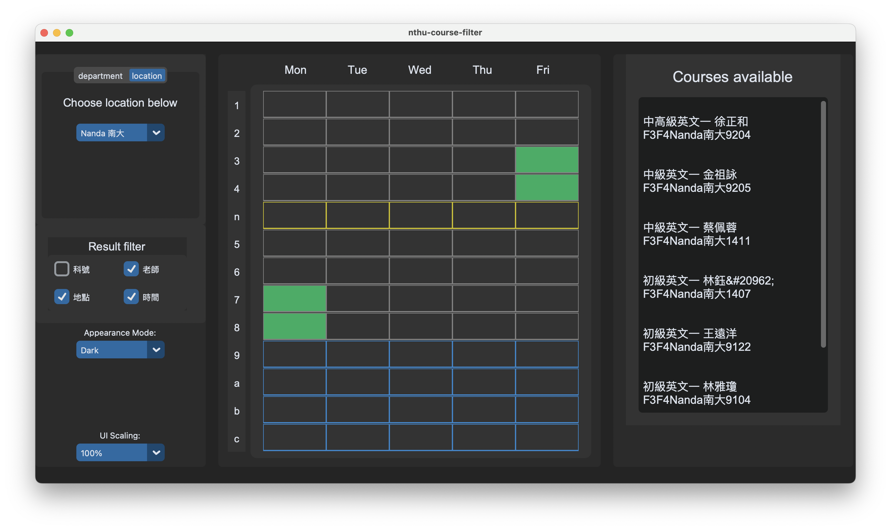

# Nthu Course Filter

## **111 GEC 1506 Logical Thinking of Informatics** Final Project

This is a GUI app based on custom tkinter, which uses web crawler to obtain the course information for the entire National Tsing Hua University during the 113th academic semester. It allows users to filter desired courses easily and intuitively based on their departments, class locations, and class schedules.


## Usage

There are two different methods available for running this app, each with its own distinct benefits. The first method is relatively easier to use, whereas the second method allows for faster app updates using git pull.
A more detailed explanation of these methods are following:
### Running the executable file (exe)
To run the NTHU Course Filter, follow these steps:

1. Download the **NTHU Course Filter** folder ([NTHU Course Filter.zip](https://drive.google.com/uc?id=1yb3E7PW2H-sboRqeEuG_111TZ-8XeJZR&export=download
)).
2. Unzip it, place the folder anywhere you prefer 
(e.g., C:\Users\User\AppData\Local\NTHU Course Filter).
3. Find the NTHU Course Filter.exe file within the folder, right-click on it, and select "Create Shortcut."
4. Rename the shortcut to your desired name (e.g., NTHU Course Filter).
5. Drag the shortcut to your desktop.

By following these steps, you will be able to easily access and run the NTHU Course Filter app.
### Run python code
[Python>=3.11](https://www.python.org/) should be available on your system.
Open CMD(Windows) or Terminal(MacOS) and paste below consoles under preferable directory.

```console
git clone https://github.com/jmyapple9/nthu-course-filter.git
cd nthu-course-filter
pip3 install -r requirements.txt
```

#### Run the app (all OS) 
> If you use anaconda, replace them with your own commands.
```console
python3 main.py
```

#### (Unix-base system)
``` console
./main.py
```

> **Warning**
> Display scaling on Windows may lead to layout broken.
>
> So don't upscale the display [over 100% on Windows](https://github.com/jmyapple9/nthu-course-filter/issues/3)

---

## Possible interface you may see:



